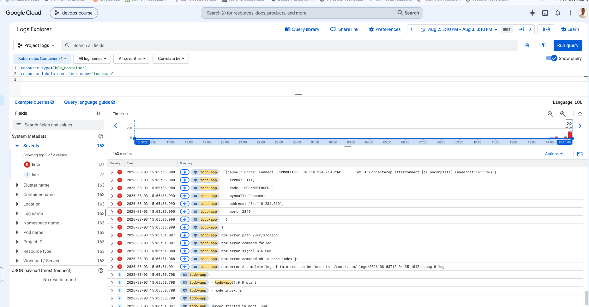

## Exercise 3.9: DBaaS vs DIY PostgreSQL

There are two main ways to operate PostgreSQL for the project:

1. Use a managed Database as a Service, such as Google Cloud SQL.
2. Run PostgreSQL inside Kubernetes using a StatefulSet and PersistentVolumeClaims.

### Google Cloud SQL — DBaaS

#### Advantages

- Cloud SQL is faster and easier to initialize because Google provisions and manages the database infrastructure.
- Routine operations such as infrastructure maintenance, patching, backups, monitoring and failover can be handled through the managed service.
- Automated backups and point-in-time recovery are easier to configure and use.
- High availability can be enabled using a regional primary and standby database.
- The database lifecycle is independent of the Kubernetes cluster. Deleting or recreating the GKE cluster does not delete the Cloud SQL database.
- It reduces the amount of database administration knowledge required from the application team.
- It is generally a safer choice for production systems where reliability and recovery are important.

#### Disadvantages

- Cloud SQL normally costs more than operating a small PostgreSQL container on infrastructure that already exists.
- Costs include database CPU, memory, storage, backups and potentially networking.
- High availability and read replicas increase the cost further.
- It creates greater dependency on Google Cloud and is less portable to another cloud provider.
- The user has less control over the database host and some low-level PostgreSQL configuration.
- Connecting securely from GKE requires additional configuration, such as private networking or a Cloud SQL connector/proxy.

### PostgreSQL in GKE — DIY

#### Advantages

- It can be cheaper for small development or learning environments because PostgreSQL shares the existing Kubernetes cluster resources.
- The team has full control over the PostgreSQL image, version, extensions and configuration.
- The setup is more portable because the Kubernetes manifests can be adapted to other Kubernetes providers.
- PostgreSQL can be deployed together with the rest of the application using the same Kubernetes and CI/CD tools.
- PersistentVolumeClaims can dynamically provision durable disks, and the stored data can survive Pod recreation.

#### Disadvantages

- Initial setup requires more work. The team must configure the StatefulSet, Service, PVC, StorageClass, credentials and database initialization.
- The team is responsible for PostgreSQL upgrades, security patches, monitoring, performance tuning and recovery procedures.
- High availability is considerably more difficult. A single PostgreSQL Pod and zonal disk create single points of failure.
- Kubernetes restarting a failed Pod does not by itself provide database replication or guarantee database-level recovery.
- Backup processes must be designed and automated, for example with `pg_dump`, WAL archiving, disk snapshots or a backup operator.
- Backups must be stored outside the cluster and regularly tested by restoring them.
- Deleting Kubernetes resources or persistent disks incorrectly can cause permanent data loss.
- `ReadWriteOnce` volumes and zonal disk attachment rules can complicate scheduling, rolling updates and recovery on another node or zone.

### Backup comparison

Cloud SQL provides managed automated backups and can support point-in-time recovery when the required logging is enabled. Restoring a backup or creating a replacement instance is available through Google Cloud tooling.

With DIY PostgreSQL, disk persistence is not the same as a backup. A PVC protects data from normal Pod replacement, but it does not protect against accidental deletion, corrupted data or application mistakes. A separate backup process and restore procedure must therefore be implemented and tested.

### Cost comparison

Cloud SQL has a clear additional service cost based on the selected CPU, memory, storage, backups, availability configuration and network usage. High-availability instances and replicas increase that cost.

DIY PostgreSQL may initially be cheaper when a GKE cluster is already running, but the real cost also includes engineering time for installation, monitoring, upgrades, backups, disaster recovery and incident handling. For a small course or development environment, DIY PostgreSQL is reasonable. For a production system, Cloud SQL is usually easier and operationally safer.

### Conclusion

For this course project, running PostgreSQL in GKE is useful because it teaches StatefulSets, PersistentVolumeClaims and Kubernetes storage.

For a real production deployment, I would normally choose Cloud SQL unless there were strong requirements for complete PostgreSQL control, cloud portability or a specialized database configuration. The higher direct cost of Cloud SQL is often justified by reduced maintenance work, simpler backups and recovery, and easier high-availability configuration.

## Exercise 3.12

The application logs were collected through Google Cloud Logging.

The logs can be found through:

Kubernetes Engine → Workloads → todo-app → Logs

The following screenshot shows the application logs collected by GKE.

